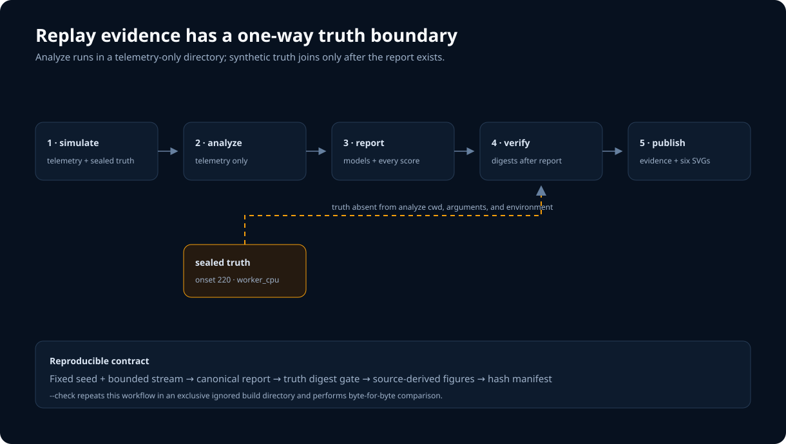
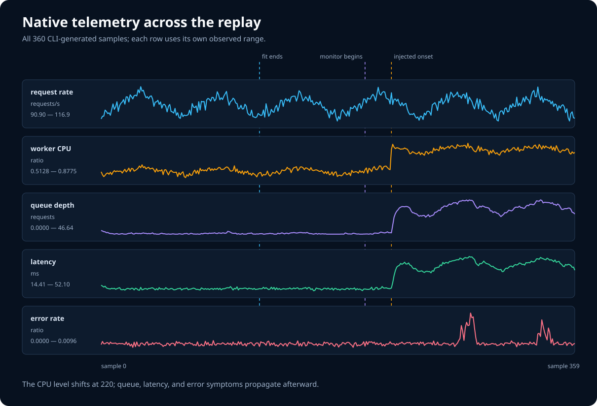
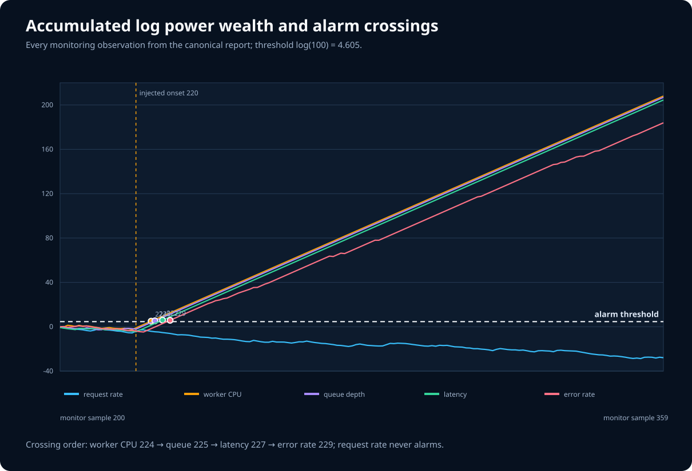
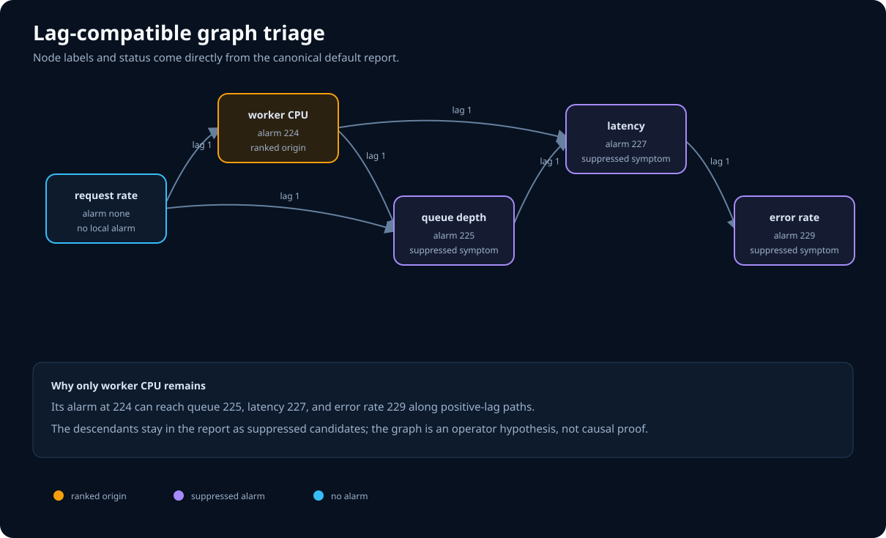
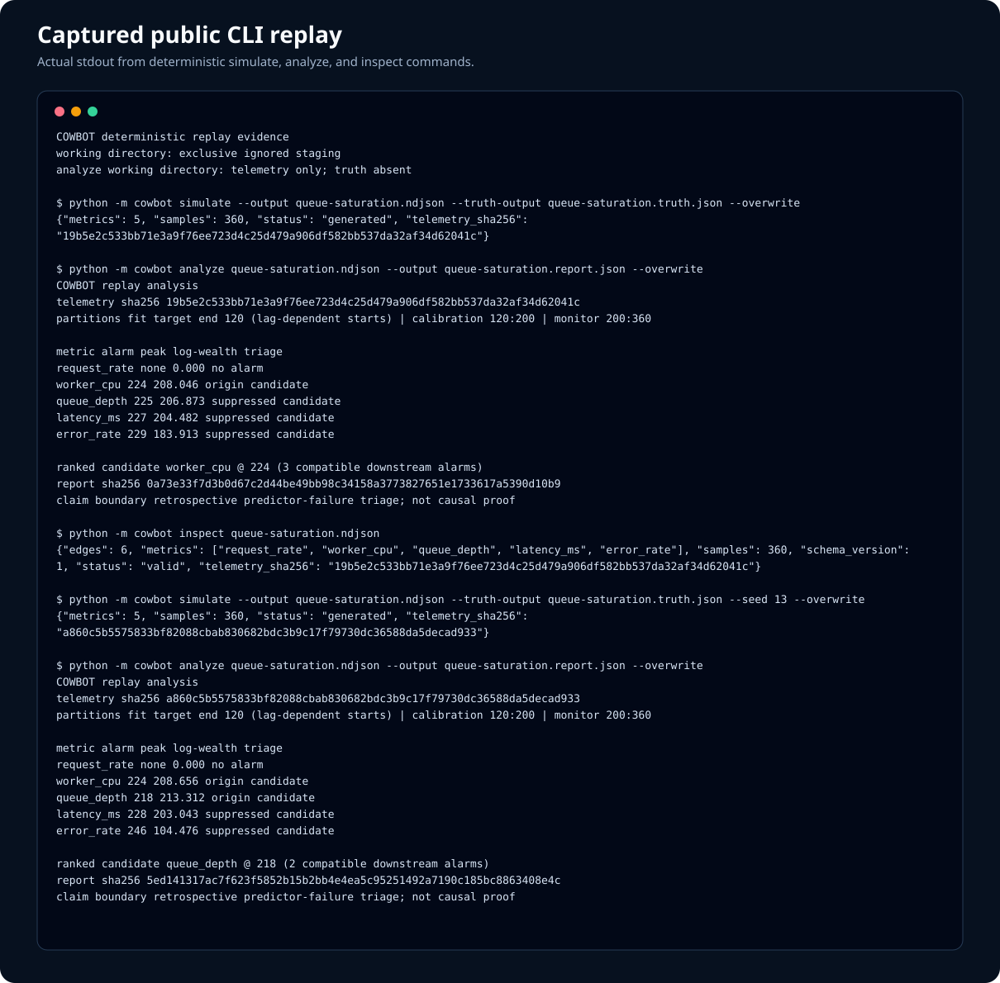
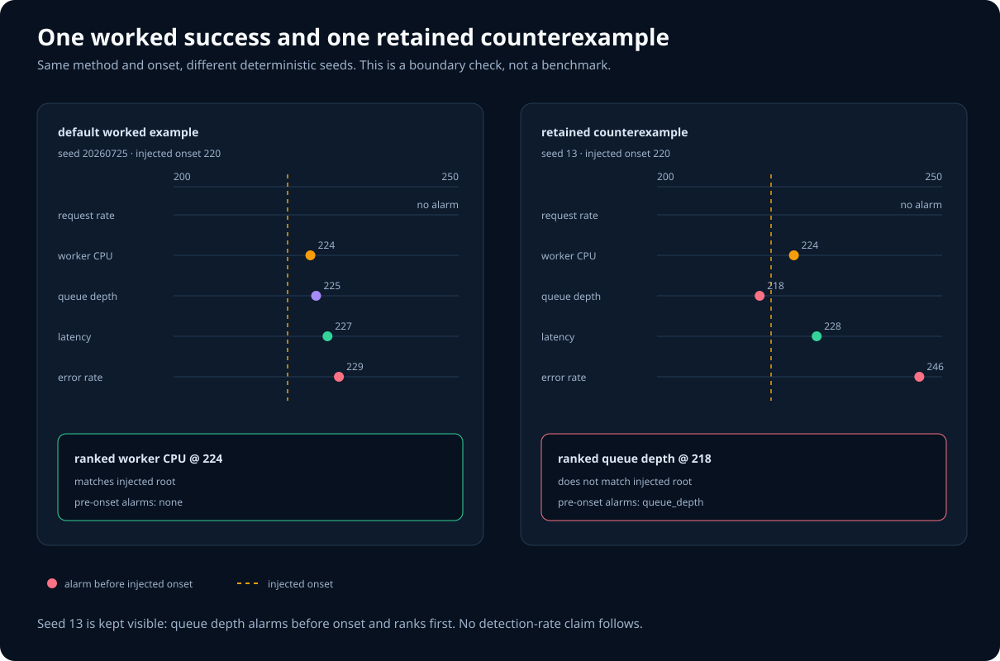
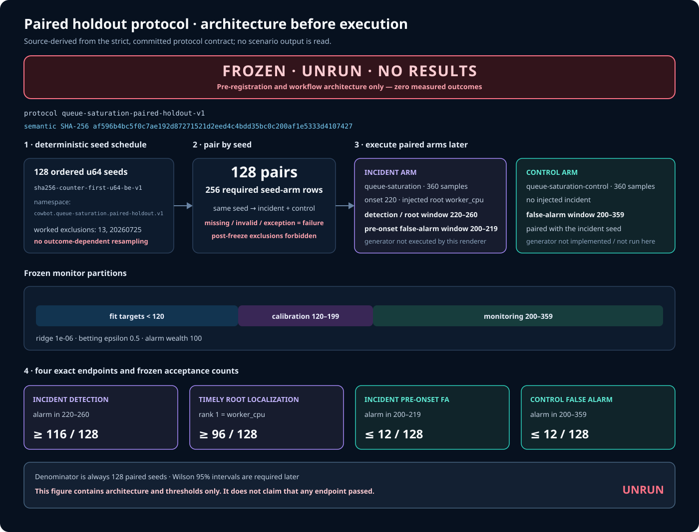

# COWBOT

COWBOT is a graph-informed, replayable mechanism watchdog for multivariate
service telemetry. It fits one small local predictor per metric, calibrates
residual ranks on a disjoint healthy partition, accumulates sequential
evidence, and uses an operator-supplied lag graph to separate a plausible
origin from downstream symptoms.

The repository is an inspectable systems slice, not a dashboard mockup:
simulation, stream contracts, bounded analysis, canonical reports, exact CLI
captures, and every figure below are executable and byte-reproducible.



*The recorder runs each analyzer in a fresh directory whose exact inventory is
the telemetry file. Synthetic truth stays in the separate simulation
directory and is opened only after the report exists, solely to verify exact
input digests and the known fixture boundary.*

## Run the complete workflow

Python 3.11 or newer is the only runtime dependency. Create an isolated
development environment once:

```bash
python3 -m venv .venv
. .venv/bin/activate
python -m pip install -e '.[dev]'
```

The development extra pins the builder, Ruff, strict mypy, and branch coverage
so the quality receipt does not depend on whichever tools happen to be
installed globally. The current 218-test suite covers 2,315 of 2,417 runtime
statements and 679 of 738 branch edges: 95.78% statement, 92.01% branch, and
94.90% combined coverage against a 94.5% fail-under gate.

```bash
make check
make report
python -m cowbot inspect artifacts/queue-saturation.ndjson
make evidence-check
make holdout-evidence-check
make distribution-check
```

The distribution gate exports one immutable Git tree twice, requires
byte-identical independently built wheels, runs the complete tests and
evidence checks from the verified sdist, then exercises the installed
`cowbot` entry point in a fresh environment. Its private receipts bind the
tree, build epoch, wheel, telemetry, truth, and report digests. Read the
[distribution integrity contract](docs/distribution-integrity.md).

The explicit detector command is:

```bash
python -m cowbot analyze \
  artifacts/queue-saturation.ndjson \
  --output artifacts/queue-saturation.report.json \
  --overwrite
```

`analyze` deliberately has no truth-file argument. It accepts at most 64 MiB
of telemetry, refuses reports above 50,000 observations or 64 MiB of JSON, and
publishes one complete canonical report atomically.

## Follow one incident end to end

The deterministic scenario contains five service signals and a cooling-loss
shift in the local `worker_cpu` mechanism at sample 220. Queue, latency, and
error symptoms propagate through the simulator afterward.



*All 360 CLI-generated samples are shown. Vertical guides mark the fit,
calibration/monitor boundary, and injected onset; each row states its real
observed range and unit.*

The default monitor uses fit targets before 120, calibration targets
`120:200`, and monitoring targets `200:360`. Each metric receives a
tie-conservative conformal rank from 80 calibration residuals. With
`epsilon=0.5`, the report accumulates log power wealth and raises a local alarm
at `log(100)`.



*Every monitoring observation in the canonical report is plotted. Worker CPU
crosses first at 224, followed by queue depth at 225, latency at 227, and error
rate at 229; request rate never alarms.*

The supplied graph is used only after the bounded replay. A descendant is
suppressed when an already-alarmed ancestor could reach it through a
positive-lag path in time.



*Report-derived alarm labels and lag-compatible paths leave `worker_cpu` as
the ranked origin candidate, while preserving every downstream candidate in
the report. This is predictor-failure triage, not proof of physical causality.*

## Inspect the actual CLI result



*This terminal figure is rendered from committed, actual stdout—not manually
typed sample output. The text artifact also includes the retained seed-13 run
and exact telemetry/report digests.*

The default report contains:

- the complete supplied schema and ordered lagged edges;
- exact fit, calibration, and monitoring configuration;
- every fitted coefficient, feature mean, scale, and calibration score;
- every monitored residual, nonconformity score, p-value, and log wealth;
- local alarm summaries, ranked origin candidates, and suppressed candidates;
- SHA-256 binding to the exact telemetry bytes and an explicit claim boundary.

Read the raw [CLI capture](docs/evidence/generated/queue-saturation.cli.txt),
[canonical report](docs/evidence/generated/queue-saturation.report.json), or
[evidence manifest](docs/evidence/generated/manifest.json) directly.

## Keep the inconvenient case

The default replay is a worked example, not a benchmark. COWBOT also freezes a
deterministic counterexample instead of tuning it away.



*With seed 13, `queue_depth` alarms at 218—before the injected onset at
220—and ranks first. The same method succeeding once and failing once makes
the boundary visible; it does not estimate detection rate or false-alarm
probability.*

The machine-readable comparison is
[`known-boundary.json`](docs/evidence/generated/known-boundary.json).

## Freeze the broad evaluation before running it

The next evaluation is pre-registered and deliberately unrun. Its strict
contract fixes 128 deterministic paired incident/control seeds, excludes the
two disclosed worked seeds, requires all 256 seed-arm rows, and counts every
missing or invalid case as a failure. No holdout scenario, control generator,
source executor, publisher, or result generator was invoked on a frozen seed
to make the figure below.



*`FROZEN · UNRUN · NO RESULTS` is the claim boundary. The diagram is derived
only from the validated protocol JSON: it exposes the pairing, monitor
partitions, exact endpoint windows, and pre-registered acceptance counts, but
contains no measured outcome or pass/fail claim.*

The semantic protocol SHA-256 shown in the figure is
`af596b4bc5f0c7ae192d87271521d2eed4c4bdd35bc0c200af1e5333d4107427`.
Read the [protocol rationale](docs/evaluation-protocol.md), the
[visual evidence note](docs/protocol-visual-evidence.md), or its exact
[source/output manifest](docs/protocol/generated/manifest.json). Verify both
generated bytes without evaluating a case:

```bash
python3 tools/render_protocol_visual.py --check
```

## Inspect the result-free harness

The implementation now includes a pure, in-memory source executor for the
exact frozen plan, but it has never been invoked on a frozen seed and is not a
CLI or publisher. The separate result-free harness materializes the exact row
plan, validates canonical row documents, reduces adverse inputs over full
denominators, and exposes one read-only repository preflight:

```bash
python -m cowbot holdout-preflight --root .
```


*The terminal visual is rendered from actual canonical stdout. It states only
what can be verified in the inspected repository: the protocol and plan
digests, 128 pairs, 256 rows, an unclaimed result namespace, and source
executor availability. It contains no seed or outcome values.*


*The plan diagram is derived from the validated protocol and immutable plan
metadata. It shows how every pair becomes an incident row followed by a
control row, and how all 21,980 canonical bytes bind to one digest without
publishing the row seeds.*


*The row-boundary diagram documents the real decoder and reducer behavior:
strict 16 KiB inputs, exact identity binding, pessimistic imputation, complete
128-case denominators, and integer acceptance gates. It is a contract diagram,
not an evaluation result.*

Read the raw [preflight capture](docs/harness/generated/holdout-preflight.cli.txt),
the exact [harness evidence manifest](docs/harness/generated/manifest.json),
or the [evidence provenance guide](docs/holdout-evidence.md). Rebuild or verify
the four result-free outputs and their manifest without executing a holdout
case or importing the source executor:

```bash
python3 tools/record_holdout_harness_evidence.py --check
```

## Engineering choices

- **Versioned replay contract.** The first NDJSON record defines units, numeric
  bounds, cadence, and a validated acyclic lag graph; sample order is strict.
- **No truth leakage in recorded runs.** Simulation writes telemetry and truth
  as a coordinated pair. The recorder copies only telemetry into a fresh
  analyzer working directory, asserts that exact one-file inventory before
  launching the real CLI, and binds the report to those bytes.
- **Partition discipline.** Fit, calibration, and monitoring targets are
  disjoint. Lag context may cross a boundary, but later targets never refit an
  earlier model.
- **Small inspectable models.** Ridge predictors use self-history plus declared
  lagged parents, fit-only standardization, explicit numeric guards, and no ML
  framework.
- **Conservative evidence language.** Reused calibration under serial
  dependence does not justify calling wealth 100 a 1% operational false-alarm
  probability.
- **Bounded and transactional I/O.** Streams, feature work, observations, and
  report bytes have hard budgets. Symlinks and special output files are
  rejected. Evidence writes reject every unexpected generated-directory entry
  before staging, pin output directories during replacement, roll back prior
  files on failure, and retain recoverable backups if restoration itself
  fails.
- **Reproducible portfolio evidence.** `tools/record_evidence.py` runs the
  public CLI in a secret-free environment, generates source-derived SVGs, hashes
  every payload and source input, and checks byte identity without touching
  tracked artifacts.
- **Verified distribution boundary.** One resolved Git tree feeds two isolated
  build roots. The gate validates raw ZIP/gzip/USTAR framing, exact metadata and
  source inventory, byte-identical wheels, the extracted sdist, and the real
  installed CLI before writing linked private receipts.
- **Result-free implementation boundary.** The holdout planner, strict row
  decoder, pessimistic reducer, and preflight import no simulator, monitor,
  source executor, report publisher, or result writer. The executor is a
  separate pure in-memory module with no filesystem, CLI, environment,
  subprocess, network, clock, or logging boundary. The harness evidence
  recorder runs only the public read-only preflight with executor/runtime
  imports blocked, checks the repository namespace before and after, and
  publishes its manifest last.

The equations, assumptions, resource budgets, and report schema are specified
in the [method contract](docs/method.md). Evidence generation and its
truth-isolation order are documented in
[the evidence guide](docs/evidence/README.md).

## Repository map

```text
cowbot/                  contracts, simulator, monitor, report, CLI
cowbot/evaluation_executor.py source-only in-memory frozen-plan executor
tests/                   behavioral, numeric, I/O, and evidence checks
tools/record_evidence.py deterministic evidence + SVG recorder
tools/render_protocol_visual.py result-free protocol documentation renderer
tools/record_holdout_harness_evidence.py result-free harness evidence recorder
tools/verify_distribution.py fail-closed wheel and sdist verifier
tools/run_distribution_gate.py immutable-tree build + installed product gate
docs/method.md           statistical and operational claim contract
docs/distribution-integrity.md packaging threat model and receipt contract
docs/evidence/generated/ real CLI outputs, boundary record, hash manifest
docs/visuals/generated/  six source-derived accessible figures
docs/protocol/generated/ frozen protocol SVG + exact source/output manifest
docs/harness/generated/  actual preflight + three source-derived artifacts
```

## Scope

The simulator is not a production workload model. Missing values, dynamic
schemas, graph discovery, online model updates, and contemporaneous edges are
unsupported. A wrong or incomplete graph can produce wrong triage. Broad
multi-seed evaluation is pre-registered and its result-free harness is
implemented. A source-only executor exists, but it has never run the frozen
population; no frozen-holdout result publisher, result files, summary, or
outcome visual exists, and the evaluation remains `frozen-unrun`. Throughput
claims and operational validation remain future work and should use data not
tuned against this included incident.

## License

MIT
