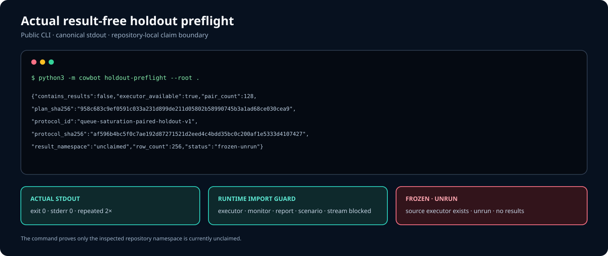
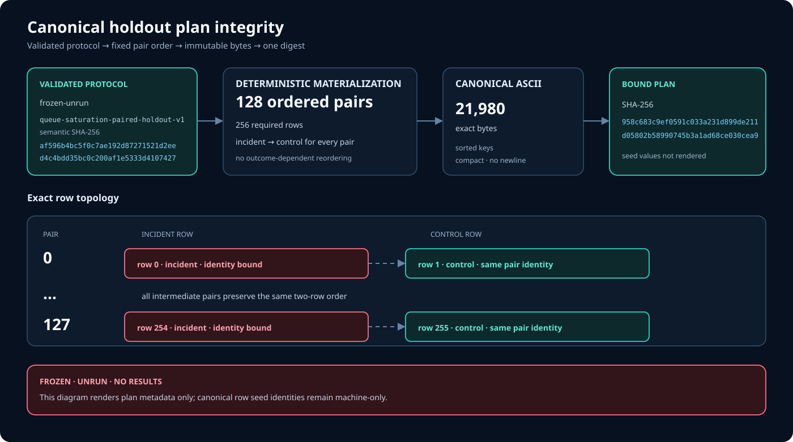
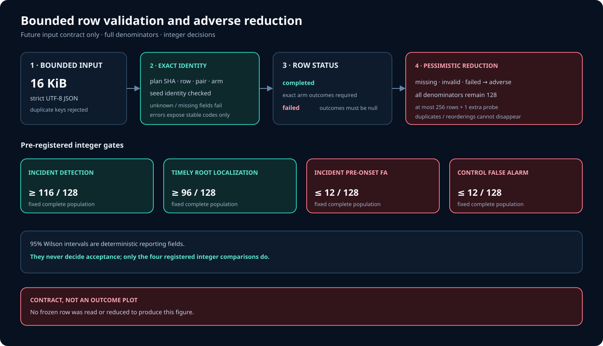

# Result-free holdout harness evidence

This evidence bundle proves that Cowbot can construct and validate the frozen
holdout plan and expose its status through the public CLI. It does **not**
contain evaluation results, execute a frozen case, or make a performance
claim. The source-only executor exists, but both evidence modes and the public
preflight neither import nor invoke it.

| Bound fact | Recorded value |
| --- | --- |
| Protocol | `queue-saturation-paired-holdout-v1` |
| Protocol state | `frozen-unrun` |
| Plan | 128 ordered pairs / 256 required rows |
| Canonical plan size | 21,980 bytes |
| Canonical plan SHA-256 | `958c683c9ef0591c033a231d899de211d05802b58990745b3a1ad68ce030cea9` |
| Executor | source available; not invoked by this evidence |
| Repository result namespace | unclaimed within the inspected repository tree |

## Actual public CLI capture



The terminal visual is rendered from the exact stdout captured from:

```console
python3 -m cowbot holdout-preflight --root .
```

The recorder runs that public command twice and requires byte-identical
canonical JSON. It also runs the same command with imports of
`cowbot.evaluation_executor`, `cowbot.monitor`, `cowbot.report`,
`cowbot.scenario`, and `cowbot.stream` blocked. All three captures must match
the validated in-process preflight contract. The unwrapped machine-readable
capture is
[`holdout-preflight.cli.txt`](harness/generated/holdout-preflight.cli.txt).

## Plan integrity



The plan visual records source-derived contract facts: protocol identity and
semantic digest, pair and row counts, deterministic arm order, canonical byte
length, and plan digest. It is an integrity view of an unrun plan, not a chart
of observed outcomes.

## Row and acceptance contract



The row visual shows the bounded 16 KiB row-validation path and the
four pre-registered acceptance thresholds:

- at least 116 of 128 incident arms produce a detection in the frozen window;
- at least 96 of 128 incident arms localize the registered root in time;
- at most 12 of 128 incident arms raise a pre-onset false alarm; and
- at most 12 of 128 control arms raise an alarm in their frozen window.

Those numbers are protocol thresholds. They are not measured pass counts.

## Exact bundle and provenance

The bundle has exactly five files:

| Artifact | Purpose |
| --- | --- |
| [`holdout-preflight.cli.txt`](harness/generated/holdout-preflight.cli.txt) | Exact canonical public CLI stdout |
| [`holdout-preflight-terminal.svg`](harness/generated/holdout-preflight-terminal.svg) | Accessible terminal rendering of that stdout |
| [`holdout-plan-integrity.svg`](harness/generated/holdout-plan-integrity.svg) | Protocol and canonical-plan integrity facts |
| [`holdout-row-contract.svg`](harness/generated/holdout-row-contract.svg) | Bounded validation and acceptance contract |
| [`manifest.json`](harness/generated/manifest.json) | Exact inventory, media types, byte counts, SHA-256 digests, source hashes, and capture audit |

The manifest uses
`cowbot.holdout_harness_evidence_manifest.v1`. Its `artifacts` array binds
every non-manifest file by path, media type, byte count, and SHA-256. The
manifest is deliberately not self-hashed. Its `source_inputs` array binds the
frozen protocol, public CLI surface, protocol and harness contracts, and
recorder source:

- `evaluation/protocol.v1.json`
- `cowbot/__init__.py`
- `cowbot/__main__.py`
- `cowbot/cli.py`
- `cowbot/contracts.py`
- `cowbot/evaluation_protocol.py`
- `cowbot/evaluation_harness.py`
- `cowbot/evaluation_executor.py`
- `tools/record_holdout_harness_evidence.py`

Artifacts are published before the manifest, so the manifest is the final
bundle marker.

## Reproduce and verify

Verify the committed bundle without writing to it:

```console
python3 tools/record_holdout_harness_evidence.py --check
python3 -m unittest -v tests.test_holdout_evidence
```

When an intentional source or rendering change requires refreshed evidence,
regenerate it and immediately verify the result:

```console
python3 tools/record_holdout_harness_evidence.py --write
python3 tools/record_holdout_harness_evidence.py --check
```

Both modes rebuild the evidence deterministically. `--check` compares every
committed byte and leaves the evidence files and reserved result namespace
unchanged. Publication rejects symlinked output paths, non-regular outputs,
and unexpected files in the generated directory.

## Safety and claim boundary

The recorder and tests enforce these boundaries:

- no holdout result file, visual prefix, case execution, executor import or
  invocation, row decoding, or adverse-row reduction;
- no seed values, secret-like material, email addresses, host paths,
  timestamps, or inherited environment sentinel in generated bytes;
- a fixed subprocess environment containing only locale, encoding, hash-seed,
  and bytecode controls, with both stdout and stderr terminated at a hard
  capture limit rather than checked only after buffering;
- accessible, self-contained SVGs with a title and description and without
  scripts, external links, embedded documents, or remote resources.

“Result namespace unclaimed” is a repository-local statement about the
inspected tree. This bundle does not prove that results do not exist elsewhere,
that the source executor would pass the protocol when run on frozen seeds, or
that the pre-registered acceptance thresholds have been met. No
frozen-holdout pass/fail outcome or outcome visual exists in this repository.
